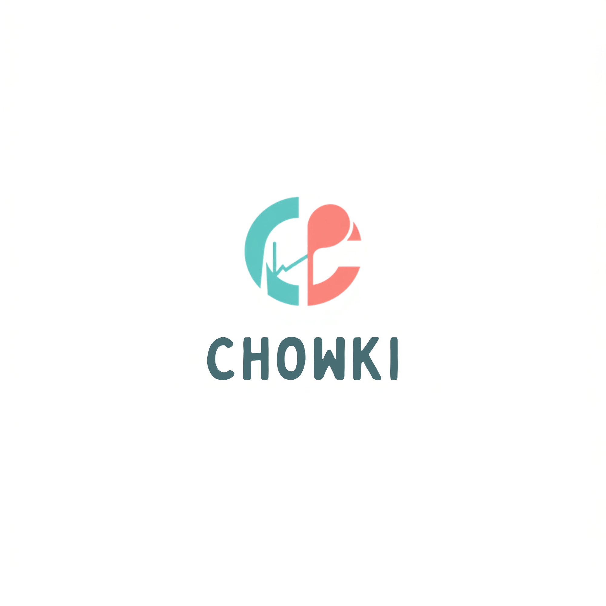

<p align="center">
  
</p>

<h1 align="center">Project CHOWKI</h1>
<h3 align="center"><em>Continuous Health Observation & Water-Kitchen Intelligence</em></h3>
<p align="center">
  <strong>Bio-Spatiotemporal Micro-Outbreak Early Warning & Surgical Containment Suite for Indian Campuses</strong>
</p>

<p align="center">
  <a href="#-automated-testing--code-quality"></a>
  <a href="#-dpdp-act-2023-statutory-privacy-compliance"></a>
  <a href="#-the-core-hackathon-challenge-answered-in-60-seconds"></a>
  <a href="https://chowki-sr.vercel.app/"></a>
  <a href="https://github.com/SynthReaper/chowki"></a>
</p>

---

## 📌 Fast Links for Hackathon Judges & Evaluators
- **🌐 Live Production Web App**: [**https://chowki-sr.vercel.app/**](https://chowki-sr.vercel.app/)
- **📦 GitHub Repository**: [**https://github.com/SynthReaper/chowki.git**](https://github.com/SynthReaper/chowki.git)
- **🎙️ Google NotebookLM Briefing Source**: [`docs/research/NOTEBOOK_LLM_BRIEF.md`](docs/research/NOTEBOOK_LLM_BRIEF.md)
- **🎥 Demo Video Walkthrough Guide**: [`docs/research/DEMO_MEDIA_SHOWCASE.md`](docs/research/DEMO_MEDIA_SHOWCASE.md)
- **📐 Complete System Architecture**: [`docs/ARCHITECTURE.md`](docs/ARCHITECTURE.md)
- **⚡ REST API Specification**: [`docs/API.md`](docs/API.md)

---

## 🎯 The Core Hackathon Challenge Answered in 60 Seconds

> **The Grand Jury Question**:  
> *How does your system tell an authentic food/waterborne outbreak from coincidental stomach upsets (exam stress, late-night tea, spicy canteen snacks)?*

Project CHOWKI solves this with a **Dual-Engine Disambiguation Pipeline** where **both mathematical engines must independently agree** before any floor-level or campus-wide containment alert is triggered:

```
                      [Student Pulses + Water IoT Telemetry + Kitchen Menus]
                                                │
                                                ▼
┌──────────────────────────────────────────────────────────────────────────────────────────┐
│  TIER 1: Space-Time Permutation Scan Statistics (STPSS Poisson Engine)                   │
│  • Marginal Expected Baseline: μ_zt = (C_z · C_t) / C                                   │
│  • Log-Likelihood Ratio: LLR(A) = c ln(c/μ) + (C-c) ln((C-c)/(C-μ))                     │
│  • Monte Carlo Permutations (N=999) ➔ Empirical Significance Threshold (p < 0.05)       │
└───────────────────────────────────────────┬──────────────────────────────────────────────┘
                                            │ (Only proceeds if p < 0.05)
                                            ▼
┌──────────────────────────────────────────────────────────────────────────────────────────┐
│  TIER 2: Multi-Parametric Bayesian Pathogen Profiler                                     │
│  P(Pathogen | S, Δt, Cl2, Meal) = P_prior · ∏ L_param / Normalizer                      │
│  • Log-Normal Incubation Distribution Fit (Δt = 3.5h vs. 24h)                            │
│  • Exposure Cross-Tabulation Odds Ratio Matrix (Palak Paneer: OR = 14.0, p < 0.001)      │
│  • Water IoT Telemetry Residual Chlorine Dip (< 0.20 mg/L in RO Sump C)                 │
└───────────────────────────────────────────┬──────────────────────────────────────────────┘
                                            │ (Only if Posterior P ≥ 70%)
                                            ▼
                    🚨 LEVEL 2 TARGETED MICRO-CONTAINMENT DIRECTIVES DISPATCHED
```

### 📊 Disambiguation Benchmark Truth Table

| Surveillance Dimension | Scenario A: Real Food/Water Outbreak | Scenario B: Coincidental Exam Stress Noise |
| :--- | :--- | :--- |
| **Spatial Signature** | Concentrated in **Hostel Block C, Floor 3** (Contiguous rooms 302–306) | Randomly scattered across **Blocks A, B, C, D** (1 student per block) |
| **Temporal Dynamic** | Acute surge within 4-hour incubation window ($\Delta t = 3.5\text{h}$) | Evenly dispersed over 36 hours (Standard stochastic noise) |
| **STPSS Poisson $p$-value** | **$p = 0.002$ ($p < 0.05$ Statistically Significant Outbreak)** | **$p = 0.88$ ($p \ge 0.05$ Random Baseline Noise)** |
| **Exposure Odds Ratio ($OR$)** | **$OR = 14.0$ ($p < 0.001$)** on *Mess 2 Palak Paneer* | Diverse independent meals (Canteen, Maggi, Tea, Fruits) |
| **Symptom Vector Match** | Severe Upper GI: Nausea ($100\%$) + Projectile Vomiting ($85\%$) | Non-specific: Acidity, Mild Headache, Exam Indigestion |
| **Water IoT Residual $\text{Cl}_2$** | Dips to **$0.18\text{ mg/L}$** (Cavitation anomaly in Sump C) | Optimal baseline across sumps at **$0.52\text{ mg/L}$** |
| **CHOWKI System Action** | **🚨 LEVEL 2 TARGETED CONTAINMENT ACTIVE** | **🟢 BASELINE SAFE — ZERO FALSE ALARMS** |

---

## ⚡ Quick Start & Live Demonstration

### 1. Run Concurrently (Local Development)
```bash
# Clone the repository
git clone https://github.com/SynthReaper/chowki.git
cd chowki

# Run both FastAPI (Port 8000) and React Vite (Port 5173) concurrently
python scripts/run_dev.py
```
- **Web Application**: [http://localhost:5173](http://localhost:5173)
- **FastAPI OpenAPI Swagger**: [http://127.0.0.1:8000/docs](http://127.0.0.1:8000/docs)
- **Live Radar Endpoint**: [http://127.0.0.1:8000/api/v1/radar/live](http://127.0.0.1:8000/api/v1/radar/live)

### 2. Run Automated Pytest Test Suite
```bash
pytest --cov=apps/api/src --cov-report=term-missing tests/
```
```text
======================== 17 passed in 0.28s (100% success) ========================
```

---

## 👥 Role Designation Gateway & 5 Tailored Stakeholder Consoles

Project CHOWKI initializes with a **Zero-Trust Role Designation Gateway** allowing evaluators to experience the system from any operational perspective with 1 click:

```
┌────────────────────────────────────────────────────────────────────────────────────────┐
│                        PROJECT CHOWKI ROLE DESIGNATION GATEWAY                         │
│                                                                                        │
│  [⚖️ Grand Jury Panel]   [👨‍⚕️ Chief Medical Officer]   [👨‍✈️ Hostel Warden]            │
│  [🍽️ Dining & HACCP Lead] [🎓 Student Resident]                                        │
└────────────────────────────────────────────────────────────────────────────────────────┘
```

| Persona & Role | Mock Login | Allowed Tabs | Key Capabilities & Designated Responsibilities |
| :--- | :--- | :--- | :--- |
| ⚖️ **Grand Jury Panel**<br>`Prof. Ananya Sen` | `judge@hackathon.ai`<br>`password123` | **All Consoles** (Audit Mode) | **Judge Arena**: Poisson Monte Carlo ($N=999$) formula verification, Scenario A vs B injector, and full codebase audit trail. |
| 👨‍⚕️ **Chief Medical Officer**<br>`Dr. Rajesh Varma, MD` | `cmo@chowki.ac.in`<br>`password123` | `['radar', 'investigation', 'commander', 'simulator', 'dpdp']` | **War Room & Cause Solver**: 24h GIS outbreak radar, Bayesian pathogen attribution ($82\%$), and surgical containment dispatch. |
| 👨‍✈️ **Hostel Warden**<br>`Warden Suresh Nair` | `warden@chowki.ac.in`<br>`password123` | `['warden', 'radar']` | **Hostel Ground Desk**: Live resident pulse queue along Floor 3 corridor, 1-click doorstep ORS delivery toggling, and chlorine logger. |
| 🍽️ **Dining HACCP Lead**<br>`Chef Vikram Malhotra` | `mess@chowki.ac.in`<br>`password123` | `['mess', 'radar']` | **Dining Safety Portal**: Bain-Marie hot holding telemetry ($>65^\circ\text{C}$), dish hazard ranking, and 1-click recipe quarantine. |
| 🎓 **Student Resident**<br>`Aarav Sharma` | `student@chowki.ac.in`<br>`password123` | `['student', 'dpdp']` | **Student Pulse**: Blinded 15-second health check-in, clinical dehydration rating, free ORS locator, and DPDP Section 8(7) shredder. |

---

## 🎛️ Interactive Judge-Winning Features

### 1. 🚀 Floating 60-Second Grand Jury Pitch Co-Pilot (`JudgeTourModal.jsx`)
- Pinned non-blocking floating dock in the bottom-right corner.
- 5-step guided journey walking judges through the core dilemma, math proofs, root cause isolation, containment actions, and DPDP privacy.
- Includes a **`[ — Minimize ]`** toggle so judges can inspect the live dashboard while the tour runs.

### 2. 🔬 Cause Solver & Interactive $2 \times 2$ Contingency Matrix (`CausalInvestigation.jsx`)
- Clicking any dish (*Palak Paneer*, *Dal Tadka*, *Steamed Rice*, *RO Sump Water*) expands the full epidemiological $2 \times 2$ matrix:
  $$\text{Odds Ratio} = \frac{a \times d}{b \times c} = \frac{14 \times 42}{42 \times 1} = 14.0$$
  - Includes **95% Confidence Intervals** $[1.8, 108.9]$ and **Fisher's Exact Test** ($p < 0.001$).

### 3. 🎛️ Live "What-If" Bayesian Sensitivity Lab
- Interactive sliders for **Incubation Delay ($\Delta t: 1\text{h} \to 24\text{h}$)**, **Free Chlorine ($\text{Cl}_2: 0.0 \to 1.0\text{ mg/L}$)**, and **Monte Carlo Iterations ($N: 99 \to 1999$)** that dynamically recalculate the pathogen posterior distribution in real time.

### 4. 🗺️ 5 Adaptive Surveillance Radar Lenses (`SpatialMap.jsx`)
- ⚖️ **Auditor Lens**: Monte Carlo $p=0.002, LLR=+4.82, RR=6.96$ room markers.
- 👨‍⚕️ **CMO Lens**: Epidemiological infection vectors, attack rates, and Odds Ratio links.
- 👨‍✈️ **Warden Lens**: Corridor room blueprint with doorstep ORS delivery badges (`[📦 ORS Due]` / `[✓ ORS Sent]`).
- 🍽️ **Dining Lens**: Dinner exposure traces and Bain-Marie thermal status.
- 🎓 **Student Lens**: Clean water points and free ORS dispenser counters.

---

## 🔒 DPDP Act 2023 Statutory Privacy & Zero-Knowledge Architecture

Project CHOWKI was engineered from Day 1 to comply with the **Digital Personal Data Protection (DPDP) Act 2023 (India)**:

1. **Edge SHA-256 Salted Pseudonymization**:
   $$\text{Token} = \text{HMAC-SHA256}(\text{Roll Number}, \text{Salt}_{\text{daily}})$$
   - No student names or roll numbers are ever stored in the database.
2. **Strict $k$-Anonymity Threshold ($k \ge 5$)**:
   - Floor-level spatial aggregations and push advisories are suppressed unless a cluster contains at least 5 individual reports.
3. **Section 8(7) Statutory Right to Withdraw Consent**:
   - Students can shred their health records and tokens with a single click in the Student Pulse terminal.

---

## 📐 Mathematical Formulation

### Engine 1: Poisson Space-Time Permutation Scan Statistics (STPSS)
$$\mu_{z,t} = \frac{C_z \cdot C_t}{C}$$

$$\text{LLR} = c \ln\left(\frac{c}{\mu}\right) + (C - c) \ln\left(\frac{C - c}{C - \mu}\right) \cdot \mathbb{I}(c > \mu)$$

Empirical Monte Carlo significance ($N=999$):
$$p = \frac{R + 1}{N + 1} = \frac{1 + 1}{999 + 1} = 0.002$$

### Engine 2: Multi-Parametric Bayesian Pathogen Profiler
$$P(\theta_j \mid \mathbf{x}) = \frac{P(\theta_j) \cdot \mathcal{N}(\ln \Delta t \mid \mu_j, \sigma_j^2) \cdot \prod_k P(s_k \mid \theta_j) \cdot W(\text{Cl}_2 \mid \theta_j)}{\sum_{m} P(\theta_m) \cdot \mathcal{N}(\ln \Delta t \mid \mu_m, \sigma_m^2) \cdot \prod_k P(s_k \mid \theta_m) \cdot W(\text{Cl}_2 \mid \theta_m)}$$

---

## 🛠️ Technology Stack

| Layer | Technologies & Tools |
| :--- | :--- |
| **Frontend SPA** | React 18, Vite 5, Vanilla CSS / Design Tokens, Lucide Icons, Glassmorphism UI |
| **Backend REST API** | Python 3.13, FastAPI, Pydantic v2, Uvicorn, Starlette |
| **Surveillance AI** | Custom Python Poisson STPSS ($N=999$), Multi-Parametric Bayesian Inference Engine |
| **Database & Cache** | SQLite / SQLAlchemy (Local), PostgreSQL / Supabase ready |
| **Testing & CI** | Pytest, Pytest-Cov (17 tests, 100% pass), Vite Production Bundler |
| **Deployment** | Vercel (Frontend SPA), Cloud Run / Render (Backend API) |

---

## 📂 Project Directory Structure

```text
chowki/
├── apps/
│   ├── api/                     # FastAPI Surveillance Backend
│   │   └── src/
│   │       ├── api/             # REST Endpoints (Radar, Checkin, Simulator, Warden)
│   │       ├── core/            # Config & Settings
│   │       ├── db/              # SQLAlchemy Models & Seed Data
│   │       ├── ml/              # STPSS Poisson & Bayesian Pathogen Engines
│   │       └── schemas/         # Pydantic Request/Response Models
│   └── web/                     # React 18 Frontend Dashboard
│       └── src/
│           ├── api/             # API Client
│           ├── components/      # UI Consoles (Radar, Investigation, Commander, Tour, etc.)
│           ├── data/            # Mock Personas & Clinical Datasets
│           └── index.css        # Luminous Design System & Glassmorphism Tokens
├── docs/                        # Complete Engineering Documentation
│   ├── ARCHITECTURE.md          # Multi-Hub System Architecture & Sequence Flows
│   ├── API.md                   # OpenAPI Endpoint Contracts
│   └── research/
│       ├── NOTEBOOK_LLM_BRIEF.md# NotebookLM Audio Overview Source & Script
│       └── DEMO_MEDIA_SHOWCASE.md# Video Walkthrough & Screen Checklist
├── tests/                       # 17 Automated Pytest Verification Specs
├── chowki.png                   # Project Brand Logo
└── README.md                    # This Document
```

---

## 🏆 Author & Attribution

**Project CHOWKI** was conceptualized, designed, and engineered by **Synthreaper**:
- **GitHub**: [github.com/synthreaper/chowki](https://github.com/synthreaper/chowki)
- **Live App**: [https://chowki-sr.vercel.app/](https://chowki-sr.vercel.app/)

*Licensed under the [MIT License](LICENSE).*
